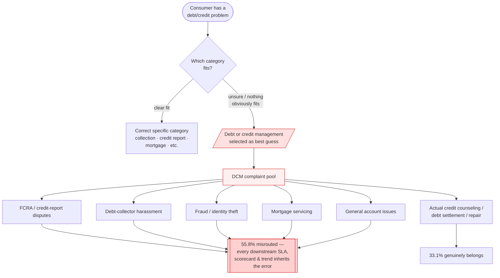
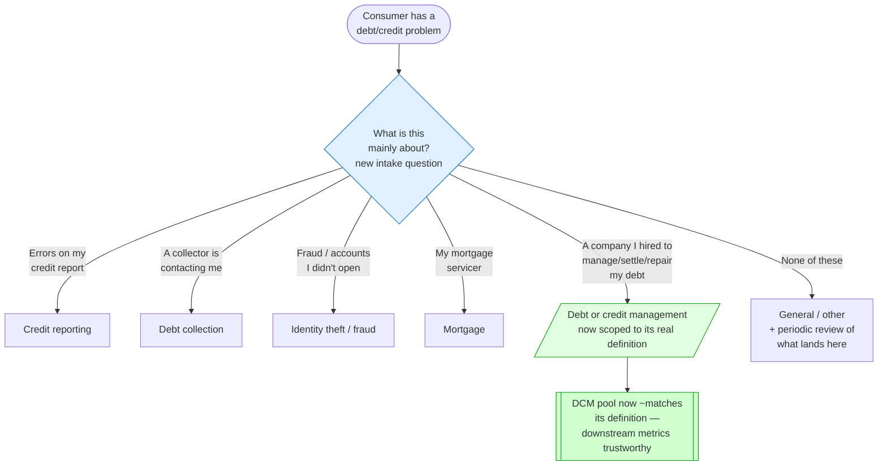

# Intake Redesign — As-Is / To-Be

Process view of the redesign recommended in
[`05_executive_brief.md`](05_executive_brief.md). The census found that **55.8%**
of "Debt or credit management" (DCM) complaints don't belong in the category —
it functions as a catch-all. These diagrams show *why* at the process level
(as-is) and *what changes* (to-be): a single branch question at intake that
routes the four biggest misfiled types to categories that already exist.

This is the "form/taxonomy fix, not a modeling fix" argument from the brief,
drawn out — the misrouting happens at the point of collection, so that's where
it has to be corrected.

## As-Is: one vague category absorbs everything adjacent

## To-Be: one branch question at intake, routing to existing categories

## Why this is the fix (not a downstream classifier)

| | As-is | To-be |
|---|---|---|
| **Where routing happens** | consumer guesses, defaults to catch-all | branch question maps intent → category |
| **DCM category** | absorbs 5+ unrelated complaint types | scoped to its actual definition |
| **Misrouting** | 55.8% | most prevented at source |
| **Downstream metrics** | inherit the error | trustworthy |
| **The 33.1% that already belonged** | unaffected | unaffected |

A downstream AI classifier (the "do nothing but flag" option in the brief)
detects the error *after* it's made, complaint by complaint, forever. The branch
question prevents most of it once. That's the case for fixing intake rather than
modeling around it.

*Scope note: the specific branch wording and the exact target categories are a
starting point for the taxonomy owner, not a final spec — the point is the
structural change (route intent at intake), not the literal button labels. The
census identified which misfiled types are large enough to deserve their own
branch; confirming the routing with the team that owns the form is step 3 of the
brief's next-steps.*
